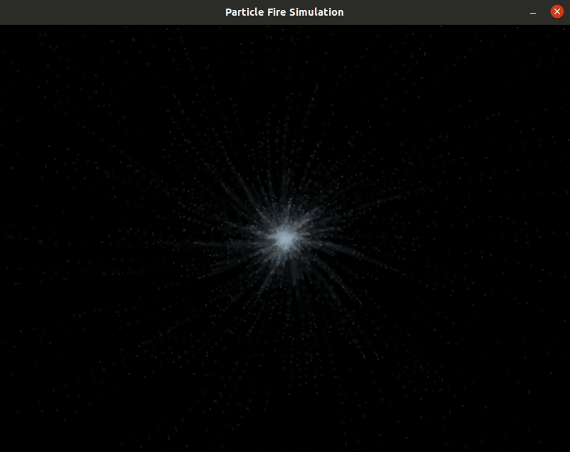

# Particle Fire Simulation

This is the program I created for my Capstone project in [Udacity's C++ Nanodegree Program](https://www.udacity.com/course/c-plus-plus-nanodegree--nd213).

##### Table of Contents 
- [Particle Fire Simulation](#particle-fire-simulation)
        - [Table of Contents](#table-of-contents)
  - [Introduction](#introduction)
  - [Demo Animation](#demo-animation)
  - [Dependencies](#dependencies)
  - [Build Instructions](#build-instructions)
    - [Basic Build](#basic-build)
    - [Incremental build](#incremental-build)
  - [Code Formatting](#code-formatting)
  - [Project Files](#project-files)
    - [`Particle.h` and `Particle.cpp`](#particleh-and-particlecpp)
    - [`Swarm.h` and `Swarm.cpp`](#swarmh-and-swarmcpp)
    - [`Screen.h` and `Screen.cpp`](#screenh-and-screencpp)
    - [`Input.h` and `Input.cpp`](#inputh-and-inputcpp)
    - [`Simulator.h` and `Simulator.cpp`](#simulatorh-and-simulatorcpp)
    - [`main.cpp`](#maincpp)
  - [Rubric Points](#rubric-points)
    - [Loop, Functions, I/O](#loop-functions-io)
    - [Object Oriented Programming](#object-oriented-programming)
    - [Memory management](#memory-management)

## Introduction

PF_Simulation is a particle fire explosion simulation program. It is written in C++, and leverages the use of Object Oriented programming methodoligies. For rendering graphics I chose to use SDL2(Simple Direct Media Layer).

## Demo Animation

## Dependencies
* cmake >= 3.7
  * All OSes: [click here for installation instructions](https://cmake.org/install/)
* make >= 4.1 (Linux, Mac), 3.81 (Windows)
  * Linux: make is installed by default on most Linux distros
  * Mac: [install Xcode command line tools to get make](https://developer.apple.com/xcode/features/)
  * Windows: [Click here for installation instructions](http://gnuwin32.sourceforge.net/packages/make.htm)
* SDL2 >= 2.0
  * All installation instructions can be found [here](https://wiki.libsdl.org/Installation)
  * Note that for Linux, an `apt` or `apt-get` installation is preferred to building from source.
* gcc/g++ >= 5.4
  * Linux: gcc / g++ is installed by default on most Linux distros
  * Mac: same deal as make - [install Xcode command line tools](https://developer.apple.com/xcode/features/)
  * Windows: recommend using [MinGW](http://www.mingw.org/)

## Build Instructions
  - [Basic Build](#basic-build)
  - [Incremental Build](#incremental-build)

### Basic Build

1. Clone this repo.
2. Compile: `make build`
4. Run it: `./build/PF_Simulation`

### Incremental build

Once the project is built, you can enter the `build` directory, and run `make`. This will rebuild only source files that have been changed.

1. Enter build directory: `cd build`
2. Compile: `make`
3. Run: `./PF_Simulation`

## Code Formatting

This project uses clang-format, and is confgured to follow [Google's C++ Style Guide](https://google.github.io/styleguide/cppguide.html). This action can be performed from within the project's root directory.

1. Enter project root dir: `cd ./PF_Simulation`
2. Format code: `make format`

## Project Files

### `Particle.h` and `Particle.cpp`
[Particle.h](include/Particle.h) and [Particle.cpp](src/Particle.cpp) define and implement the `Particle` class. This class is responsible for the creation of a particle. The `Particle::init` method sets the direction and speed of a particle and redraws the particle according to its current location on the screen.
`Particle::update` method updates the particle based on an interval calculation. It also has setter and getter methods for the x and y private members.

### `Swarm.h` and `Swarm.cpp`
[Swarm.h](src/Swarm.h) and [Swarm.cpp](src/Swarm.cpp) defines and implements the `Swarm` class, which is responsible for gathering a collection of particles via the `Swarm::getParticles` method. The `Swarm::update` method wraps the `Particle::update` method, iterates through the amount of the `NPARTICLES` const, which is currently set to a value of `5000`, after which updates with an interval of time elapsed. 

### `Screen.h` and `Screen.cpp`
[Screen.h](include/Screen.h) and [Screen.cpp](src/Screen.cpp) define and implement the `Screen` class, which uses the SDL
 library to render the particle swarms on the screen. The `Screen::setPixel` method set pixel coordinate and color using bit shifting operations. The `Screen` class also includes the `Screen::update` method, that updates the screen texture and rendering via SDL functions. Last but not least, The `Screen` class has `Screen::boxBlur` method which is responsible for adding a blur affect to pixels. Incrementally increasing the blur affect the longer the pixel stays on the screen.

### `Input.h` and `Input.cpp`
[Input.h](include/Input.h) and [Input.cpp](src/Input.cpp) define and implement the `Input` class.  This class contains the method `Input::processEvents` that
 handles input from the user, using poll events via the [SDL2](https://www.libsdl.org/) library. Currently the user can click the `X` on the window to exit the program.

### `Simulator.h` and `Simulator.cpp`
[Simulator.h](include/Simulator.h) and [Simulator.cpp](src/Simulator.cpp) define and implement the `Simulator` class.  This class contains the method `Simulator::run` which has the main simulation loop. It runs this loop waiting for user input before exiting the while loop.

### `main.cpp`
[main.cpp](src/main.cpp) is the entry point for the program. The `main` function in this file sets up a random seed generator for time calculations. Then, the `main` function
  creates instances of the `Simulator` and `Input` class. Finally, the simulation is started by
   calling the `Simulator::run` method.

## Rubric Points
Below are the rubric points that are addressed/implemented in this project.

### Loop, Functions, I/O
- The project demonstrates an understanding of C++ functions and control structures.

### Object Oriented Programming
- The project uses Object Oriented Programming techniques.
- Classes use appropriate access specifiers for class members (see `Screen.h`, `Particle.h`, `Swarm.h`, `Simulator` and
 `Input.h`).
- Classes abstract implementation details from their interfaces.
- Classes encapsulate behavior.

### Memory management
- The project makes use of references in function declarations (see line 30 in `Particle.h`, and see line 29 in `Simulator.h`).
- The project uses destructors appropriately (see line 17 in `Swarm.cpp`, and line 73 and 74 in `Screen.cpp`).
 